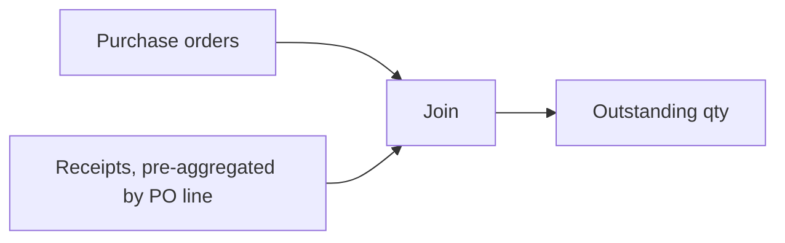

## Background

For two months, our open-purchase-order dashboard reported a number that was roughly triple the real figure. Nobody caught it immediately, because the number moved up and down in a way that looked plausible — it just happened to be plausible and wrong.

## Deep-dive

The report joined purchase orders to receipts to get outstanding quantity. The problem: a single PO line could have multiple partial receipts, and the join fanned out before the aggregation ran.

```sql
-- wrong: fans out one PO line into N rows before aggregating
select
    po.po_id,
    po.qty_ordered,
    sum(po.qty_ordered) as total_ordered   -- inflated by receipt fan-out
from purchase_orders po
join receipts r on r.po_id = po.po_id
group by po.po_id, po.qty_ordered;
```

Every additional partial receipt against a line multiplied `qty_ordered` into the sum again. A line received in three shipments contributed its ordered quantity three times.

The flow that should have prevented this — aggregate receipts *before* joining — looks like this:



## Where it broke

The fix is to aggregate receipts to one row per PO line first, then join:

```sql
with receipt_totals as (
    select po_id, sum(qty_received) as qty_received
    from receipts
    group by po_id
)
select
    po.po_id,
    po.qty_ordered,
    coalesce(rt.qty_received, 0) as qty_received,
    po.qty_ordered - coalesce(rt.qty_received, 0) as qty_outstanding
from purchase_orders po
left join receipt_totals rt on rt.po_id = po.po_id;
```

One row per PO line, no fan-out, no silent multiplication.

## Takeaways

- A join that fans out before an aggregation will inflate any `sum()` downstream of it — always aggregate the "many" side first.
- Dashboards that move plausibly are not the same as dashboards that move correctly; spot-check totals against a source system periodically, not just when something looks obviously wrong.
- A CTE that pre-aggregates makes the intent of the query readable, which would have caught this in review.
